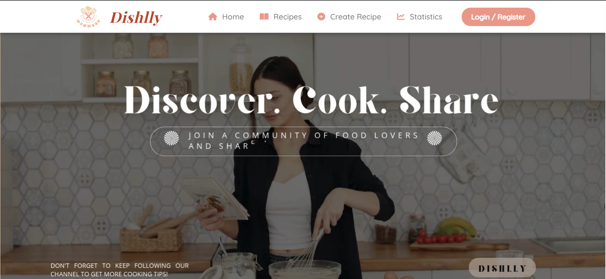
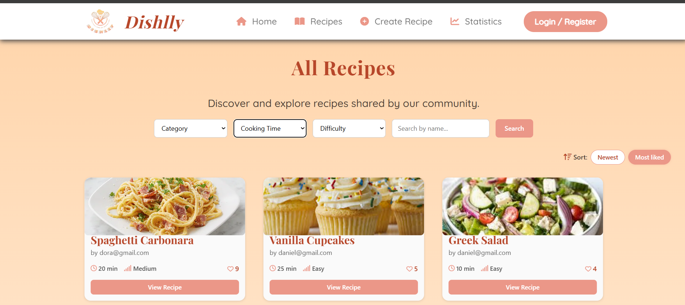

  

<h1 align="center">
  <b>Social Recipe Network</b>
</h1>

  A modern web platform for sharing, discovering and interacting with recipes.

---

## 🚀 Technologies Used

  
  
  
  
  
  

---

## 📖 About the Project

**Dishlly** is a social recipe sharing platform where users can:
- Share recipes
- Like and comment on posts
- Explore trending recipes
- Discover cooking ideas

---

## ✨ Features

### 🍳 Recipe Hub
- Create and edit recipes
- Add ingredients and steps
- Assign category, difficulty and preparation time

### ❤️ Social Features
- Like recipes
- Comment on recipes
- Engage with other users

### 📊 Statistics
- Top 3 most liked recipes
- Most active users
- Popular categories

---

## 🏗️ Architecture

- ASP.NET Core MVC
- Entity Framework Core (Code-First)
- Repository & Service Pattern
- Dependency Injection (DI)
- Razor Views + Bootstrap UI

---

## 🔐 Security

- Authentication & Authorization
- Role-based system:
  - 👑 Admin — manages content and moderation
  - 👤 User — creates and manages recipes

---

## 🧠 OOP Principles

- ✔ Encapsulation
- ✔ Inheritance
- ✔ Abstraction
- ✔ Polymorphism

---

## 📷 Screenshots

  
  

---

<h2 align="center">
 If you like the app, you can give a 🌟 to my repository!
</h2>
